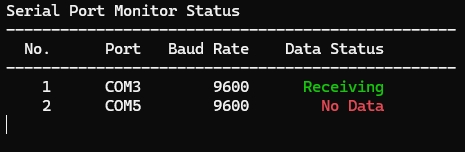

# 串口数据采集器

[English](README.md)

一个支持多串口并发采集的跨平台串口数据采集工具。



## 功能特点

- 支持多串口并发数据采集
- 通过 JSON 配置串口参数
- 实时状态显示，带颜色指示
- 自动数据文件管理
- 跨平台支持（Windows/Linux）

## 目录结构
```bash
SerialPortCollector/
├── CPP/
│   ├── main.cpp          # 主程序入口
│   ├── SerialPort.h      # 串口类声明
│   ├── SerialPort.cpp    # 串口实现
│   ├── Config.h          # 配置类声明
│   ├── Config.cpp        # 配置实现
│   └── CMakeLists.txt    # CMake 构建配置
├── data/                 # 数据存储目录（自动创建）
└── config.json          # 串口配置文件
```
## 文件说明

### main.cpp
- 程序入口点
- 实现多线程数据采集
- 状态监控和显示
- 数据保存管理

### SerialPort.h/cpp
- 串口通信类的实现
- 跨平台串口操作封装
- 支持 Windows 和 Linux 系统

### Config.h/cpp
- 配置文件管理
- JSON 配置解析
- 默认配置生成

### CMakeLists.txt
- CMake 项目配置
- 跨平台构建支持
- 依赖项管理

## 详细代码说明

### 主要类和结构

#### PortConfig 结构体
```cpp
struct PortConfig {
    std::string name;        // 串口名称
    int baudRate;           // 波特率
    int dataBits;          // 数据位
    int stopBits;          // 停止位
    std::string parity;    // 校验方式
    bool addTimestamp;     // 是否添加时间戳
    int timeout;           // 超时时间（秒）
};
```

#### SerialPort 类
- 负责串口的打开、关闭、读取操作
- 支持跨平台实现
- 错误处理和状态管理

#### Config 类
- 配置文件的读取和解析
- 默认配置的生成
- 配置验证和错误处理

## 开发环境

### Windows 环境
- Visual Studio 2019/2022
- CMake 3.10+
- vcpkg 包管理器
- Windows SDK 10.0+

### Linux 环境
- GCC 8.0+
- CMake 3.10+
- 串口开发库

### 依赖库
- nlohmann-json：JSON 解析库

## 编译步骤

### Windows 平台

1. 安装必要工具：
```bash
# 安装 vcpkg
git clone https://github.com/Microsoft/vcpkg.git
cd vcpkg
.\bootstrap-vcpkg.bat
.\vcpkg integrate install

# 安装依赖
.\vcpkg install nlohmann-json:x64-windows
```
2. 编译项目：
```bash
cd SerialPortCollector/CPP
mkdir build
cd build
cmake .. -DCMAKE_TOOLCHAIN_FILE=[vcpkg根目录]/scripts/buildsystems/vcpkg.cmake
cmake --build . --config Release
```
### Linux 平台

1. 安装依赖：
```bash
sudo apt-get install build-essential cmake
sudo apt-get install nlohmann-json3-dev
```
2. 编译项目：
```bash
cd SerialPortCollector/CPP
mkdir build
cd build
cmake ..
make
```
## 配置文件说明

### config.json 示例
```json
{
    "ports": [
        {
            "name": "COM1",
            "baudRate": 9600,
            "dataBits": 8,
            "stopBits": 1,
            "parity": "none",
            "addTimestamp": true,
            "timeout": 60
        }
    ]
}
```
### 参数说明
- name: 串口名称（Windows: COM1, Linux: /dev/ttyUSB0）
- baudRate: 波特率（常用值：9600, 115200）
- dataBits: 数据位（通常为 8）
- stopBits: 停止位（1 或 2）
- parity: 校验方式（none, odd, even）
- addTimestamp: 是否在数据中添加时间戳
- timeout: 无数据超时时间（秒）

## 运行时状态显示

### 状态颜色说明
- 绿色：正在接收数据
- 黄色：等待数据中
- 红色：超时无数据（超过配置的超时时间）

### 显示内容
- 串口编号
- 串口名称
- 波特率
- 当前状态

## 数据存储格式

### 目录结构
```bash
data/
├── COM1/
│   ├── 20240118.data
│   └── 20240119.data
└── COM2/
    ├── 20240118.data
    └── 20240119.data
```
### 数据文件格式
- 文件名：YYYYMMDD.data
- 数据格式：[时间戳] 数据内容（如果启用时间戳）

## 故障排除

### 常见问题
1. 串口打开失败
   - 检查串口名称是否正确
   - 确认串口未被其他程序占用
   - 验证用户权限

2. 数据接收异常
   - 检查波特率设置
   - 验证串口参数配置
   - 检查硬件连接

3. 编译错误
   - 确认所有依赖已正确安装
   - 检查 CMake 配置
   - 验证编译器版本

## 许可证

MIT License

## 作者

luoqi
- GitHub: [@keirosang](https://github.com/keirosang)

## 开机自启动配置

### Windows 系统

1. 创建快捷方式
   - 找到编译好的程序（SerialPortCollector.exe）
   - 右键创建快捷方式
   - 右键快捷方式，选择"属性"
   - 在"起始位置"填写程序所在目录的完整路径
   - 或者修改"目标"，在程序路径前添加 `cd /d` 命令，例如：
     ```
     cmd /c "cd /d C:\Program Files\SerialPortCollector && SerialPortCollector.exe"
     ```

2. 添加到启动文件夹（确保使用正确的工作目录）
   - 按 Win + R，输入 `shell:startup` 打开启动文件夹
   - 将配置好工作目录的快捷方式复制到启动文件夹中

3. 使用任务计划程序（推荐）
   - 打开任务计划程序（搜索 "Task Scheduler"）
   - 创建基本任务
   - 设置名称和描述（如 "SerialPortCollector"）
   - 触发器选择 "当计算机启动时"
   - 操作选择 "启动程序"
   - 浏览选择程序路径
   - **重要：** 在 "起始位置(可选)" 中填写程序所在目录的完整路径
   - 可选：设置 "以最高权限运行"

### Linux 系统

1. 使用 Systemd 服务（推荐）
   - 创建服务文件：
```bash
sudo nano /etc/systemd/system/serialportcollector.service
```
   - 添加以下内容：
```ini
[Unit]
Description=Serial Port Collector Service
After=network.target

[Service]
Type=simple
User=your_username
WorkingDirectory=/path/to/program/directory
ExecStart=/path/to/program/SerialPortCollector
Restart=always
RestartSec=3

[Install]
WantedBy=multi-user.target
```
   - 启用服务：
```bash
sudo systemctl daemon-reload
sudo systemctl enable serialportcollector
sudo systemctl start serialportcollector
```

2. 使用 rc.local（适用于旧系统）
   - 编辑 rc.local 文件：
```bash
sudo nano /etc/rc.local
```
   - 在 `exit 0` 前添加：
```bash
/path/to/program/SerialPortCollector &
```
   - 确保 rc.local 有执行权限：
```bash
sudo chmod +x /etc/rc.local
```

3. 使用桌面环境自启动（GUI 环境）
   - 创建 .desktop 文件：
```bash
nano ~/.config/autostart/serialportcollector.desktop
```
   - 添加以下内容：
```ini
[Desktop Entry]
Type=Application
Name=SerialPortCollector
Exec=/path/to/program/SerialPortCollector
Hidden=false
NoDisplay=false
X-GNOME-Autostart-enabled=true
```

### 注意事项

1. Windows 注意事项：
   - 确保程序路径不包含中文
   - 建议使用管理员权限运行
   - 可以在任务计划程序中设置失败重启
   - **工作目录设置：**
     * 程序需要在正确的工作目录下运行才能找到配置文件
     * 可以使用以下方法之一确保正确的工作目录：
       1. 在快捷方式属性中设置"起始位置"
       2. 使用批处理文件启动程序：
          ```batch
          @echo off
          cd /d "%~dp0"
          start SerialPortCollector.exe
          ```
       3. 修改程序代码，使用程序所在目录作为配置文件路径
     * 建议将配置文件和程序放在同一目录下

2. Linux 注意事项：
   - 确保程序有执行权限
   - 检查用户对串口设备的访问权限
   - systemd 服务日志查看：
```bash
sudo systemctl status serialportcollector
sudo journalctl -u serialportcollector
```

3. 通用注意事项：
   - 建议使用绝对路径
   - 确保配置文件位置正确
   - 建议添加错误日志记录
   - 确保数据存储目录有写入权限